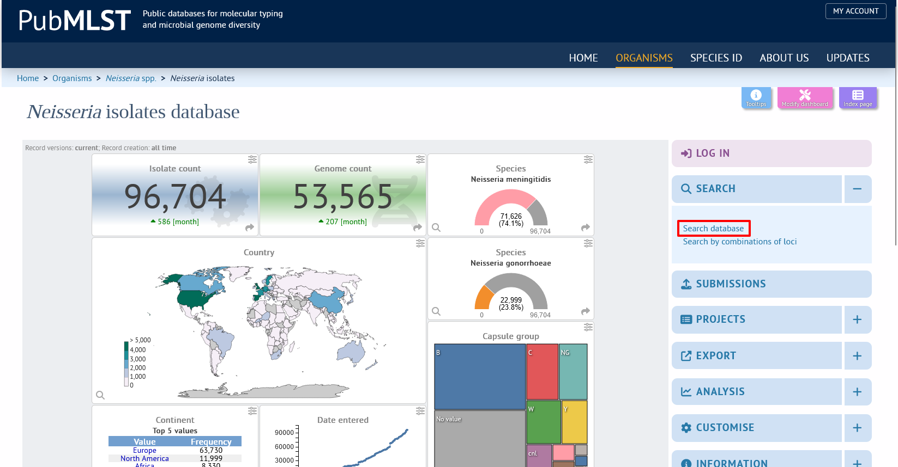
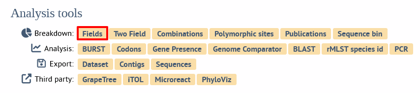

# Molecular Approaches to Clinical Microbiology in Africa 2023

2 - 8 September 2023
 
Kenya Medical Research Institute (KEMRI)

## Topic: Bioinformatics

**Instructors: Dr. Keith Jolley, Dr. Odile Harrison, and Prof. Martin Maiden**

## Background

This module aims to introduce participants to bioinformatic analysis of molecular and genomic data.

## Learning outcomes

* Gain familiarity with the Linux operating system and command line;
* Understand the concepts of sequence alignment and tree building;
* Explore and analyse genomic datasets on PubMLST.

## Practical 1: Introduction to the Linux command line and BLAST

In this practical we will be introducing the Linux command line. Most bioinformatics tools run on Linux and so a familiarity with its use can be very helpful. To provide a real-world example of its power we will use the stand-alone BLAST package to create a local database that can be queried to identify a sequence. In this case we will construct a database of 16S sequences and use this to try to identify the species using sequences from four bacterial samples.

Commands are typed in to a console window. This is accessed in different ways on different versions of Linux, but there should be either a menu entry or icon for ‘console’ or ‘terminal’. For the Linux system used on the course this is highlighted below: 


We will be using a number of commands to navigate the Linux file system. Commands that appear in a box should be typed directly in to the console window, e.g.

```
ls *
```

**Linux is case-sensitive – it is important that commands are typed exactly as shown, including spaces.**

### Navigation
In this section we will gain a familiarity with the Linux commands used to navigate the file system and interact with files and directories. Type everything that appears in the boxes.

#### List files in your home directory.

List non-hidden files in your current directory:
```
ls
```	
List all files in your current directory:
```
ls -a
```
#### Change current directory to the root of the file system and explore the directory structure.

To go to the root (top-level) of the filesystem:
```
cd /
```
List non-hidden files in your current directory with extended information (file size, dates, owner). You can combine command attributes, e.g. (-a: show all; -l: show long information; -h: show human-readable file sizes):
```
ls -lh
```
Show the current directory (print working directory):
```
pwd
```
Change current directory to /home and list the contents:
```
cd /home
ls -l
```
Change to the parent directory and list the contents:
```
cd ..
ls -l
```
Go back to your home directory, list the contents, and check where you are in the file system hierarchical structure:
```
cd ~
ls
pwd
```
### Creating a BLAST database
Make sure that you are in your home directory:
```
cd
pwd
```
We are now going to create a directory where we will generate the BLAST database. To do this, we use the ``mkdir`` (make directory) command.
```
mkdir blast
```
To enter a directory, we use the ``cd`` command (change directory). Enter the newly created blast directory.
```
cd blast
```
Now we will obtain reference 16S sequences. These are available from the SILVA website (<https://www.arb-silva.de>). For this practical the sequences are available in a file stored in a directory on your computer (/usr/local/share/MACMA/bioinformatics/16S_ref.fasta.gz).

Copy the compressed sequence file to the current directory. A dot (.) on its own in a command means the current directory. The .gz ending indicates that the file is compressed using gzip.
```
cp /usr/local/share/MACMA/bioinformatics/16S_ref.fasta.gz .
```
> **_Note_** that if you wish to run this practical later on your own computer, you can obtain this file from <https://www.arb-silva.de/fileadmin/silva_databases/release_132/Exports/SILVA_132_SSURef_Nr99_tax_silva.fasta.gz>. This URL has been shortened by tinyurl to <https://tinyurl.com/y7dh2htc>.  You can download files using the ``wget`` command.   
> 
> ``wget https://tinyurl.com/y7dh2htc --output-document=16S_ref.fasta.gz``

 We can see the size of this file by using the ``ls`` command with the -l (long) -h (human-readable) arguments.
```
ls -lh
```
You should see something like the following:
> ``-rw-rw-r-- 1 keith keith 230M Dec 11  2017 16S_ref.fasta.gz``

The file size is 230MB.

Before we can use it, we need to uncompress it using the ``gunzip`` command. This is quite a large file and will therefore take a few seconds to uncompress.
```
gunzip 16S_ref.fasta.gz
```
When the file has finished uncompressing you will see that the file size is now much bigger and the .gz prefix has been removed from the filename.
```
ls -lh
```

> ``-rw-rw-r-- 1 keith keith 1.1G Dec 11  2017 16S_ref.fasta``

The file size is now 1.1GB.

You can look at the contents of this file using the ``less`` command. Scroll through the file using the space key, go back using the ‘b’ key and exit by pressing ‘q’. The file is in FASTA format, with taxonomic information in the header line for each sequence.
```
less 16S_ref.fasta
```
We can use this file to create a BLAST database against which we can query the specimen sequences. Creating the database will take about 2-3 minutes.
```
makeblastdb -in 16S_ref.fasta -dbtype nucl -out 16Sdb
```
Now if you list the contents of the directory, you should see 3 new files: 16Sdb.nhr, 16Sdb.nin and 16Sdb.nsq. These together comprise the BLAST database.

16S sequences have been generated for 4 specimens. You can download these from <https://pubmlst.org/static/training/16S.tar>.
```
wget https://pubmlst.org/static/training/16S.tar
```
This file is an uncompressed tar archive containing individual files for each specimen. Extract the files using the tar command.
```
tar xvf 16S.tar
```
If you now list the directory, you should see FASTA files for specimens 1-4.

Query each sequence against the newly-created BLAST database. As these are nucleotide sequences and the BLAST database has been created using nucleotide sequences, we should use the ``blastn`` command.
```
blastn -db 16Sdb -query specimen1.fas -out specimen1.out
```
View the output using the ``less`` command:
```
less specimen1.out
```
Scroll down until you come to the first alignment. Alignments are shown in score order so the better alignments are shown first. Can you identify the species?

Do the same for the other specimen files. You may wish to limit the number of results
```
blastn -db 16Sdb -query specimen2.fas -out specimen2.out -num_alignments 5
```

## Practical 2: Constructing phylogenetic trees

### Introduction to phylogenetic analysis
For these exercises we will be using the program MEGA (Molecular Evolutionary Genetics Analysis). This is a free application that will run on Windows, MacOS or Linux and is available from <https://megasoftware.net/>. The exercise will be run as an interactive session with a talk. Please stop and wait for the next part of the talk when you reach a stop sign:


You have been provided with a dataset that consists of the sequences of a gene for a collection of diverse *Mycobacteria* spp. isolates spanning the known diversity of the genus. You can find these sequences in https://github.com/WCSCourses/MolAppAfrica_2023/tree/main/course_data/bioinformatics/phylogenetics. For the workshop we will be running this practical using the Linux virtual machines - the data have already been installed on these, but you will need to copy them into your account to make it easy to drag-and-drop the files. To do this, open a terminal window and type:

```
mkdir Desktop/phylogenetics
cp /usr/local/share/MACMA/bioinformatics/*.fas Desktop/phylogenetics
```

You should now see a new folder on your desktop called 'phylogenetics' that contains two files. You will be able to drag-and-drop from here into the MEGA window later.


We will be looking at the *rplB* gene that encodes one of the proteins that make up the ribosome, the essential protein factory of the cell. Some ribosomal protein genes are involved in antibiotic resistance within *Mycobacteria*, and may therefore be under diversifying selection, but this gene is not. With its essential role we should, therefore, expect it to be relatively conserved within a species, making it a good candidate for phylogenetic analysis.

### Aligning and formatting data
The sequences have been provided in FASTA format. This is the simplest and probably most common format for sequence data. Each sequence within a FASTA file consists of a header line beginning with a ‘>’ character followed by the sequence identifier and optional comments separated by a ‘|’ character. The sequence itself appears on the following line(s) and continues until either the next header line (beginning with a ‘>’) or the end of the file, e.g.

```
>seq_1
TTTGATACTGTTGCCGAAGGTTTGGGCGAAATTCGCGATTTATTGCGCCGTTATCATCAT
GTCAGCCATGAGTTGGAAAATGGTTCGAGTGAGGCCTTATTGAAAGA
>seq_2
TTTGATACCGTTGCCGAAGGTTTGGGTGAAATTCGCGATTTATTGCGCCGTTACCACCGC
GTCGGCCATGAGTTGGAAAACGGTTCGGGTGAGGCTTTGTTGAAAGA
>seq_3
TTTGATACCGTTGCCGAAGGTTTGGGTAAAATTCGCGATTTATTGCGCCGTTACCACCGC
GTCGGTCATGAGTTGGAAAACGGTTCGGGTGAGGCTTTGTTGAAAGA
```
MEGA can read FASTA files. Sequences need to be aligned before they can be used to generate phylogenetic trees.

Run MEGA and open the mycobacteria.fas file now found in the phylogenetics folder on your desktop. 


You can either click the ‘Data’ button and then select the file, or simply drag-and-drop the file in to the main interface.


A dialog box will ask you whether to ‘Analyze or Align file’ – select ‘Align’.


The sequences will be loaded in to the ‘Alignment explorer’ window.


Select all the sequences by clicking ``Edit .. Select All``. 


Click the Alignment tab and select Align by MUSCLE (codons):


Aligning by codon takes account of the fact that these are protein-encoding sequences so the alignment is performed by first translating the codons to amino acids, performing the alignment, and then finally replacing the amino acids with the original codons. This will produce a more robust alignment for coding data than aligning individual nucleotides. 

Alignment options will appear. Leave the default values and click ‘OK’.


You will be asked whether you would like to remove gaps before alignment. Click ‘Yes’:


You will then get a warning that there are stop codons found in the translated sequences. Click 'Ignore' since these are at the ends of the gene and do not affect the alignment.


### Distances
You can now perform phylogenetic analysis. Click on the ‘Data’ tab and select ‘Phylogenetic Analysis’:


The data are protein encoding, so answer ‘Yes’ when asked:


The aligned data are available in the main MEGA window.

In order to re-construct a tree from sequence data we need to calculate the genetic distances between each sequence. There are different ways of doing this, employing different evolutionary models. The simplest is the p-distance which is basically a count of the number of differences between two aligned sequences divided by the length of the sequences. Select ‘Distances’ in the main MEGA window and then select ‘Compute Pairwise Distances…’ in the dropdown menu.


You may be asked if you want to use the currently active file. Say 'yes'.

 

An ‘Analysis Preferences’ dialog will be displayed. Select  ‘p-distance’ in the Model/Method section leaving all other options at their default.


Click ‘OK’. A distance matrix will be calculated and displayed. The distance between sequences 1 (*M. abscessus*) and 2 (*M. gilvum*) is 0.1182795699. This corresponds to 99 nucleotide differences in a total shared length of 837 bases, i.e. (99/837).


If you re-calculate distances using a different model, you will see that the values are slightly different. Recalculate using the Jukes-Cantor model. The distance is now 0.1287197008. This difference is due to a multiple hit correction.


### Tree building
Now you can generate a Neighbor-Joining tree by selecting ‘Phylogeny’ in the main MEGA window and then ‘Construct/Test Neighbor-Joining Tree’.


Accept the default options and click ‘OK’.


A ‘Tree Explorer’ window will open. 


The rectangular tree can be misleading because by default it will root at the midpoint whereas the root may not be known. A radiation tree is often a better way to draw an unrooted tree because no assumption of the root is implied. You can show a radiation tree by clicking on the tree icon and selecting ‘Radiation’.


Switching off the labels will make the tree clearer. You can do this by unchecking the 'Taxon names' checkbox.

Often we will want to explicity root a tree using an outgroup – one or more nodes that we know to be more dissimilar than the other members of the tree. A second dataset has been provided that includes the same dataset with the addition of the rplB sequence from a Corynebacterium diphtheriae isolate.
Load the mycobacteria+C_diphtheriae.fas file, align it and generate a Neighbor-joining tree.


Now we can see where the root should be, as *Corynebacterium diphtheriae* is the most distance node in the tree. We can explicitly root the tree using this node by selecting the branch from *Corynebacterium diphtheriae* to the other isolates, right-clicking and selecting ‘Root’.


### Bootstrap tests
Bootstrapping is a way of testing the reliability of an inferred tree. It works by randomly replacing a subset of the data and testing whether the topology of a tree generated from these new sequences changes. If it does not then there is a strong signal supporting the topology and we can be more confident of the groupings. The test provides a percentage value for each branch of the tree.

From the MEGA main window, select Phylogeny and Neighbor-joining tree again. This time, in the section marked ‘Phylogeny Test’, select Test of Phylogeny ‘Bootstrap method’ leaving other options at their default settings.


The bootstrap values will be displayed on each branch of the tree.


## Practical 3: Introduction to molecular sequence typing using PubMLST
PubMLST.org (https://pubmlst.org) is a free online web-based resource that supports sequence typing nomenclature as well as containing extensive isolate and genome libraries.

In this practical we will be using the PubMLST *Neisseria* database to identify MLST alleles, sequence types (STs), and the finetyping antigen peptide (PorA and FetA) variants, for a set of capsular group X meningococcal isolates from Africa. Sequence data for these can be found at https://github.com/WCSCourses/MolAppAfrica_2023/tree/main/course_data/bioinformatics/sequence_typing/.

First download and open the Excel worksheet (https://github.com/WCSCourses/MolAppAfrica_2023/raw/main/course_data/bioinformatics/sequence_typing/worksheet.xlsx). Fill this in as you go.

If you wish, you can download all the files as a zip archive from https://github.com/WCSCourses/MolAppAfrica_2023/raw/main/course_data/bioinformatics/sequence_typing/data.zip. 

### Navigating PubMLST
Open a new browser window and type: https://pubmlst.org/neisseria

You will see that the home page is divided into 5 sections:

* A	-	An interactive map summarising all *Neisseria* records in PubMLST;
* B -	‘Typing’: a catalogue of genes annotated in the Neisseria species, including the typing genes PorA, FetA, the capsule locus, and MLST house-keeping genes;
* C -	‘Isolate collection’: a repository of all isolates deposited in the database
* D -	‘Genome collection’; and,
* E -	‘Submit’ where users can submit data for curation and storage in PubMLST.


Click 'Typing'.

### Querying sequences

You will see a contents page. To query sequences we will be using the 'Single sequence' query. Click this.


Open the first sequence file [01_BuFa1-11.fas](https://github.com/WCSCourses/MolAppAfrica_2023/blob/main/course_data/bioinformatics/sequence_typing/01_BuFa1-11.fas). You will see DNA sequence for the MLST loci (*abcZ*, *adk*, *aroE*, *fumC*, *gdh*, *pdhC*, and *pgm*) as well as for the *porA* and *fetA* genes. You can query a single sequence by copy and pasting it into the web form and selecting the locus. Try this for the *abcZ* sequence, selecting this locus in the dropdown box.

> Make sure you select 'abcZ' and not 'abcZ (NEIS1015)' as this is not the gene fragment used in MLST - it is the full length gene used in cgMLST.


Click 'Submit'.


This should have identified the sequence as abcZ-10. Fill this result in your spreadsheet and continue with the other loci. For the PorA results you will need to select 'PorA_VR1' and 'PorA_VR2' loci, and for the FetA results select 'FetA_VR'.

> Note that what is happening behind the scenes here is that the software is creating a BLAST database of known *abcZ* alleles, performing a query of your pasted in sequence against this, and then interpreting the results of the BLAST query for output on the web page. This is the same as you did in practical 1.

### Looking up a ST number
When you have a complete MLST profile, you can look up the ST number for it. From the contents page, click the search for allelic profiles 'by allelic profile' link.


Enter the allelic profile in the boxes and click 'Search'.


Enter the result in your spreadsheet.

### Speeding it all up
You have probably found that querying each locus in turn is a bit tedious :-). Fortunately you can paste in the entire sequence file into the search box (it will accept even whole genome assemblies) and select  either 'MLST' or 'Finetyping antigens' in the locus box. This will search either all the MLST loci, or all the finetyping loci in one go and return the results. In the case of MLST, it will even look up the ST number if it finds a complete profile. If you have downloaded the sequences to your local computer you can also drag-and-drop the file rather than pasting.

Try to complete the rest of the spreadsheet. It should now be much quicker to do.

### Questions

1. How many different STs are present in the dataset?
2. Do some profiles appear to be similar to others? - if so what can you tell from this?
3. How many groups of similar STs are there?
4. Is there any geographical signal present in the data?
5. Are the antigens associated with a particular ST always the same?

## Practical 4: Whole genome sequence analyses using PubMLST
PubMLST.org (https://pubmlst.org) is a free online web-based resource which uses the Bacterial Isolate Genome Sequence database (BIGSdb) genomics platform. In addition to extensive data libraries (>1,200,000 bacterial isolates and >1,000,000 genomes) PubMLST incorporates typing information and analytical tools for identifying and storing genetic variation on a gene-by-gene basis (1). PubMLST databases are available for many bacterial species, including *Neisseria meningitidis* within the PubMLST Neisseria database, which can be used to type bacteria enabling epidemiological and other investigations. 

In this practical you will use PubMLST to analyse whole genome sequence (WGS) data from meningococci isolated in Africa. These data originate from 716 meningococci obtained 2011-2016 from 11 countries in the meningitis belt and were published in EBioMedicine in 2019 (2). 

### Navigating PubMLST
Open a new browser window and type: https://pubmlst.org/neisseria

You will see that the home page is divided into 5 sections:

* A	-	An interactive map summarising all *Neisseria* records in PubMLST;
* B -	‘Typing’: a catalogue of genes annotated in the Neisseria species, including the typing genes PorA, FetA, the capsule locus, and MLST house-keeping genes;
* C -	‘Isolate collection’: a repository of all isolates deposited in the database
* D -	‘Genome collection’; and,
* E -	‘Submit’ where users can submit data for curation and storage in PubMLST.


Click on ‘Isolate collection'.

You will see a dashboard summary of the information held within the database.

Expand the 'Search' menu by clicking the '+' icon, and then click ‘Search database’.



You will see a simple search page which allows you to construct queries consisting of isolate provenance information.


At the time of writing (August 2023), there were whole genome sequence data belonging to over 33,000 meningococci and, for our analyses here, we need to find from these, the 716 meningococci linked to the publication by Topaz et al. 

To do this, we can search for isolates by publication. Additional search criteria can be added by clicking the ‘Modify form' tab using the ‘spanner’ icon on the far right and selecting selected options.


Click the '+' icon next to 'Filters' which will enable a dropdown filter for publications:


Using the dropdown menu next to Publication, type in the filter box ‘Topaz’, select the resulting publication found (Topaz 2019), then click on SEARCH.

This should return 716 records with a small (customizable) dashboard summarizing the results. Each isolate has a unique ID number, and you can see in the table below some brief information about them, i.e. isolate name, country of origin, year of isolation, MLST ST and clonal complex. 


### Analyzing returned datasets
At the bottom of any page of results you will find a number of buttons that will take you to a variety of analysis functions using the results of your query:


For example, you can breakdown the results by provenance field by clicking the ‘Fields’ button:



A series of maps and charts will be displayed. You can move between charts by selecting different fields in the dropdown box. Some of the charts can be displayed in different ways, e.g. changing colour scheme or map projection.


Use the drop-down menu to answers the questions below:

1.	What years do the isolates date from and how many isolates were found in 2015?

2.	Which capsule group was most frequently found in this dataset?

3.	What MLST STs were found? (Hint need to click on the ‘schemes’ radio button). Which STs were the top four most prevalent? 

4.	How does this compare with clonal complex distribution?

The data can also be exported in text or Excel formats. 

You can also break one field down against another using the ‘Two Field’ breakdown:


This allows you to combine any field. For example, country vs capsule group:


Use the 'Two field' query to answers the questions below:

1.	Which year had the most group C isolates?

2.	Which clonal complex do the group C isolates belong to?

3.	Which country had the most ST-10217 clonal complex isolates?

4.	What capsule group were ST-11 isolates?

### Phylogenetic analyses
Additional analysis tools are available in PubMLST, which we will use to examine the dataset more closely.

#### Minimum Spanning trees using GrapeTree
Genomic relationships among isolates can be visualized using the tool GrapeTree (3). 

Navigate back to your isolate list and click on ‘GrapeTree’ at the bottom of the results page:


This tool creates minimum-spanning trees (MST) that cluster isolates based on similarities in their allelic profiles. It is important to note that the resulting tree is not based on nucleotide sequences themselves, but on allelic comparisons. This speeds up the analysis and goes a long way to mitigating the effects of horizontal genetic exchange in these organisms.

You should get the following page below:


We will compare the isolates using the ‘N. meningitidis cgMLST v2’ scheme. This consists of >1400 loci which have been identified as core genes - defined as those present in more than 95% of the meningococcal genomes examined (4). 

The resulting minimum-spanning tree can be annotated using any associated metadata, which we can select in the ‘Include fields’ section. Using the CTRL (or CMD key if on a Mac) select the following options: ‘capsule group’; ‘clonal complex (MLST)’; ‘country’; ‘disease’; ‘ST (MLST)’; and ‘year’. Click submit. 

The job should take less than 2 minutes to complete. On the resulting page. Click on ‘Launch GrapeTree’.

The following MST will be visible. Each node represents one isolate and clusters of nodes indicate isolates which share allelic profiles in the core genome and are therefore related. Node colours can be changed by expanding the 'Tree Layout' menu and  selecting the metadata field from the 'Node style' dropdown box. Node size can also be altered by dragging the bars on the 'Node size' and 'Kurtosis' (node size relative to number of strains) bars.


Nodes can be moved around by clicking and dragging them. You can also allow the layout to self-optimize by expanding the 'Rendering' menu, unselecting 'Selected Only' and selecting 'Dynamic' (make sure you do it in that order or it won't work!).


Use the node colouring and labelling options to answer the following questions:

1.	What observations can you make about capsule groups and their distribution in the MST?

2.	How does this relate to the clonal complexes found?

3.	What can you tell about ST-10217 isolates?

Colour schemes can also be altered. Colour the nodes by year, then right click on the legend to change the colour scheme to ‘Gradient: Warm’ and the order grouped by ascending label:


4.	Based on this information what can you deduce about the ST-10217 clonal complex?

#### Genome Comparator
Genomes can also be compared using the Genome Comparator tool. This compares isolates using a gene-by-gene method, generates a NeighborNet tree and in addition provides information on the number and precise identification of locus differences among isolates. This tool works particularly well for more highly related isolates. We will use this to analyze ST-10217 isolates. 

Navigate back to your isolate list and select isolates belonging to the ST-10217 clonal complex (note that there is a clonal complex dropdown box in the list of filters).


This will return 126 records. At the bottom of the page select ‘Genome Comparator’:


On the following page, select the ‘N. meningitidis cgMLST v2’ scheme. Additional isolate identifiers can be included in the analysis although this should be kept to a minimum to prevent the resulting tree becoming overcluttered. Select country and year. Click ‘Submit’.


When the analysis is complete, a series of output data will be present. One will be a downloadable Excel spreadsheet with multiple tabs. These various tables show alleles found at each of the loci. Any alleles with the same number (and colour) will be indicative of identical genes. An interesting tab to explore is the ‘Distance Matrix’ tab. This depicts a heat map displaying the number of locus differences between isolates.

Explore these data to answer the following questions:

1.	On average, how many locus differences were found between isolate 39654 originating from Niger and isolates from Nigeria, Burkina Faso and Mali? 

2.	What is unusual about isolate 58398 originating from Mali?

3.	What about isolate 39809?

### Bibliography
1.	Jolley KA, Bray JE, Maiden MCJ. Open-access bacterial population genomics: BIGSdb software, the PubMLST.org website and their applications. [Wellcome Open Res. 2018;3:124](https://pubmed.ncbi.nlm.nih.gov/30345391/).
2.	Topaz N, Caugant DA, Taha MK, Brynildsrud OB, Debech N, Hong E, et al. Phylogenetic relationships and regional spread of meningococcal strains in the meningitis belt, 2011-2016. [EBioMedicine. 2019;41:488-96](https://pubmed.ncbi.nlm.nih.gov/30846392/).
3.	Zhou Z, Alikhan NF, Sergeant MJ, Luhmann N, Vaz C, Francisco AP, et al. GrapeTree: Visualization of core genomic relationships among 100,000 bacterial pathogens. [Genome Research. 2018;28:1395-1404](https://pubmed.ncbi.nlm.nih.gov/30049790/).
4.	Bratcher HB, Corton C, Jolley KA, Parkhill J, Maiden MC. A gene-by-gene population genomics platform: de novo assembly, annotation and genealogical analysis of 108 representative Neisseria meningitidis genomes. [BMC Genomics. 2014;15:1138](https://pubmed.ncbi.nlm.nih.gov/25523208/).

### Further questions

* What happened to invasive meningococcal disease after the introduction of PsA-TT (MenAfriVac®) vaccine?

  * Was this uniform across the meningitis belt?
 
* What would be your advice to policy makers

  * Should vaccination programmes be continued, ended, or changed?

* How would you support this advice with genomic data?  

  * How can this information be presented to different audiences?
